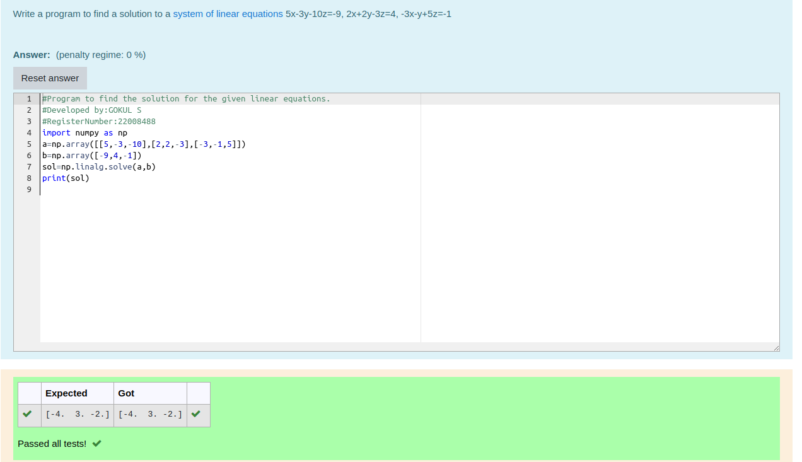

# -SOLUTION-TO-A-SYSTEM-OF-LINEAR-EQUATIONS

## Aim:
To write a python program to find a solution to a system of linear equations.

## Equipment’s required:
1. 	Hardware – PCs
2. 	Anaconda – Python 3.7 Installation / Moodle-Code Runner

## Algorithm:

### Step 1: Import numpy package
### Step 2: Get the input matrices
### Step 3: Find the solution to a system of linear equations
### Step 4: Print the result

## Program:
```python
#Program to find the solution for the given linear equations.
#Developed by:GOKUL S
#RegisterNumber:22008488
import numpy as np
a=np.array([[5,-3,-10],[2,2,-3],[-3,-1,5]])
b=np.array([-9,4,-1])
sol=np.linalg.solve(a,b)
print(sol)
```

## Output:


## Result: 
Thus the solutions for the linear equations are successfully solved using python program

